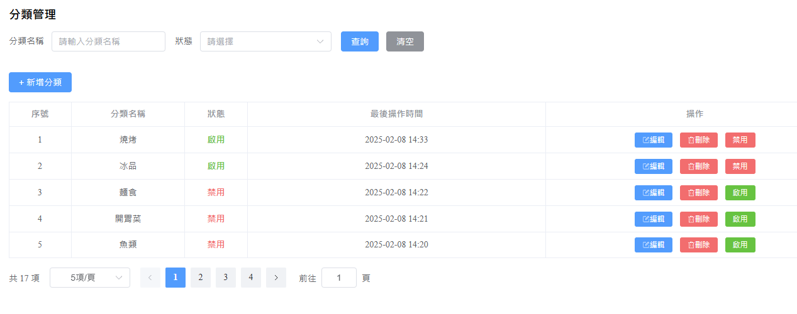

# 點餐系統 ( Ting Ordering System )

這是一個基於 Spring Boot 和 Vue.js 的點餐系統，分為管理端與顧客端。

此專案已經使用 Docker 部署，方便本地和雲端環境運行。

---

## 部署與運行

##### 前提條件

* 安裝 [Docker](https://www.docker.com/get-started) 
* 安裝 [Docker Compose](https://docs.docker.com/compose/install/)
* 安裝 [Maven](https://maven.apache.org/download.cgi)

##### **運行專案**

1. 克隆專案

```bash
git clone https://github.com/a85009546/ting-ordering-system.git
cd ting-ordering-system
```

2. 將放在`ting-ordering-system\backend\ting-server\src\main\resources` 的配置文件`application-example.yml` 中，`alioss.access-key-id` 與 `alioss.access-key-secrect` 改成自己的。
   沒有的話，除了圖片上傳功能以外，其他功能可以正常運行。
3. 生成 jar 檔

```bash
# 進入後端目錄
cd backend/

# 使用 Mavan 打包 JAR 檔
mvn clean package

# 返回專案根目錄
cd ..
```

4. 使用 Docker Compose 啟動前後端容器：

```bash
# 在 ting-ordering-system 目錄下執行指令
docker-compose up --build
```

5. 這會構建並啟動前端和後端服務以及初始化數據庫，接著你可以在 http://localhost 訪問應用。

6. 停止容器：

```bash
docker-compose down
```

##### **登入**

本專案有三種角色，管理者、員工、顧客

* 管理者帳號 : admin
* 員工帳號 : employee
* 顧客帳號可自行在註冊頁面註冊 ( 登入頁面中的註冊按鈕可切換至註冊頁面，如下圖 )
* 三種角色密碼皆為 : 123456 


---

## 主要功能

- **管理端 - 管理者、員工**
  - 訂單管理
  - 餐點管理
  - 分類管理
  - 餐點瀏覽
  
  - 員工管理
  - 數據統計
  - 運營報表導出
  - 來單提醒
  
- **顧客端**
  - 餐點瀏覽
  - 購物車
  - 地址管理
  - 查看歷史訂單
  - 下單
  - 催單 
  - 再來一單
  
- **通用**
  - 用戶註冊與登入
  - 個人中心
  - 支援文件上傳 ( 圖片 )

---

## 技術棧

- **前端** : Vue.js、Pinia、Element-Plus、Apache ECharts
- **後端** : Spring Boot、Spring MVC、Spring Task、JWT、阿里雲 OSS、POI、WebSocket
- **數據存儲** : MySQL、Redis
- **容器化** : Docker
- **工具** : Git、Maven、Apifox
- **其他** : Nginx


---

## 系統架構介紹

前端使用 Vue.js，後端使用 Spring Boot，並透過 RESTful API 進行數據交換。
此外，系統使用 MySQL 儲存數據，Redis 作為緩存，並透過 Docker 容器化部署。

**關鍵技術架構：**

- **前端 (Vue.js)**：負責用戶介面顯示與 API 請求
  - 使用 Vue Router 管理頁面
  - 使用 Pinia 用於全局狀態管理
  - Element-Plus 作為 UI 框架
- **後端 (Spring Boot)**：提供 REST API
  - 使用 JWT 進行身份驗證
  - 透過 Mybatis 連接 MySQL
  - 使用 Spring Task 處理超時訂單、持續處於派送中的訂單
  - 使用 阿里雲OSS 作為圖片存儲
  - 使用 Apache POI 來操作 Excel，輸入運營報表
  - 使用 WebSocket 實現來單通知與催單提醒
  - 通過 AOP 實現公共欄位的自動填充
- **數據庫 (MySQL)**：存儲用戶、訂單、餐點等核心業務數據。
- **緩存 (Redis)**：用於存儲熱點數據，如餐點以及用戶的JWT。
- **Nginx**：作為反向代理，處理前端靜態資源並轉發 API 請求。
- **Docker**：將前後端及數據庫容器化，方便部署與運行。


##### **系統架構圖**


**圖示說明**

* 前端透過 **Nginx** 訪問後端 API
* Spring Boot 負責業務邏輯處理，**並與 MySQL、Redis 進行數據交互**
* Redis 主要用於**高頻讀取的數據**


##### **JWT 生成與校驗流程圖**


**圖示說明**

1. **用戶登入**：
   - 用戶提供帳號和密碼。
   - 驗證成功後生成 JWT，並將其存入 Redis。
   - 返回 JWT 給用戶。
2. **請求校驗**：
   - 用戶發送請求時攜帶 JWT。
   - 從 JWT 中提取用戶 ID，並從 Redis 獲取對應的 JWT。
   - 比對請求中的 JWT 和 Redis 中的 JWT。
   - 校驗成功則允許請求，否則拒絕。
3. **用戶修改密碼或登出**：
   - 刪除 Redis 中存儲的 JWT。
   - 確保舊的 JWT 失效。


##### **Redis緩存餐點流程圖**


---

## 圖片展示

### 登入頁面


### 首頁

* 頂部選單包含營業狀態 ( 管理端可修改 )、地址管理、購物車、修改密碼、退出登入

* 左側為選單列表，會隨角色不同顯示不同選單項


### 動態選單

* 根據不同角色顯示不同選單項
* 由左至右分別是 : 管理者、員工、顧客


### 管理端

##### 修改營業狀態


##### 員工管理

* 包含員工的增刪改查


##### 分類管理

* 包含分類的增刪改查、啟用跟禁用分類



##### 餐點管理

* 包含餐點的增刪改查 ( 可批次刪除 )、上架與下架餐點


##### 訂單管理

* 可追蹤並更新訂單狀態
* 根據訂單號、手機號碼、下單時間查詢訂單
* 查詢訂單詳情
* 動態顯示各訂單狀態的數量


##### 數據統計

* 包含營業額、顧客、訂單、銷量排名
* 可根據昨日、近7日、近30日、本周、本月，動態顯示
* 運營數據報表一鍵導出


##### 來單通知

* 當顧客下單並且支付成功後，管理端的右上角會出現來單通知


##### 催單提醒

* 當顧客使用催單功能時，管理端的右上角會出現催單提醒


---

### 顧客端

##### 註冊頁面

* 包含參數校驗


##### 餐點瀏覽

* 員工也有此頁面，但會關閉點餐按鈕，作為權限控制


##### 購物車

* 購物車圖標會動態顯示品項數量


##### 結帳頁面

* 點擊購物車中的 " 去結算 " 後，會跳轉到結帳頁面


##### 支付彈窗

* 點擊結帳頁面中的 " 提交訂單 " 後，會出現支付彈窗，會動態顯示剩餘支付時間
* 若選擇稍後支付，會跳轉至歷史訂單，可在該頁面支付


##### 歷史訂單

* 可在此頁面查詢歷史訂單
* 可在此頁面支付待付款的訂單
* 可對已支付的訂單使用催單功能


##### 地址管理


### 通用功能

##### 個人中心

* 可在此修改基本資料


##### 修改密碼

* 可在此修改密碼，修改後跳轉至登入頁面


##### 更換頭像

* 點擊頭像圖標會有彈框，可上傳圖片


